# **🌷 이미지 캡셔닝 게임**

[TOC]

------

## **💜 프로젝트 소개** 

---

AI를 통해 사진에서 인식한 사물을 증거로 모아 사건의 실마리를 풀어나가는 모바일 추리 게임

## **✔ 사용스택**

------

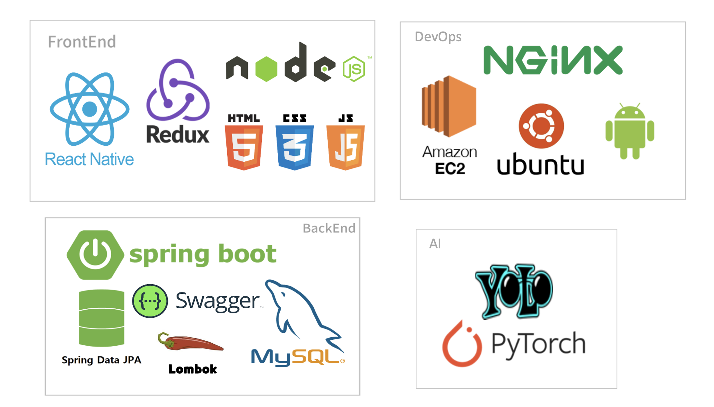

**Backend**

- Spring Framework 4.0.5

**Frontend**

- React Native
- MUI

**AI**

- PyTorch
- GPT-2 ko

## **:blue_book: 프로젝트 산출물**

---

[**기능명세서**](docs/기획/기능명세서.md)

[**ERD**](docs/기획/ERD.png)

[**포팅메뉴얼**](exec/)

[**와이어프레임**](docs/기획/와이어프레임.jpg)

## **:floppy_disk: 프로젝트 결과물**

---

[**Build**](Build/)

## **:movie_camera: 영상**

---

#### **프로젝트 시연영상**

1. 오프닝 페이지

   

2. 회원가입

   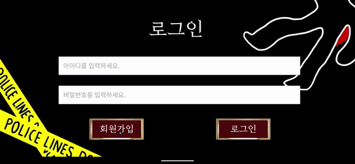

3. 로그인

   

4. 로그아웃

   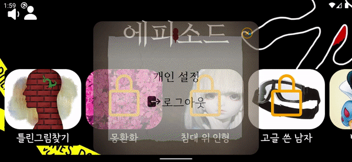

5. 에피소드 및 챕터 선택

   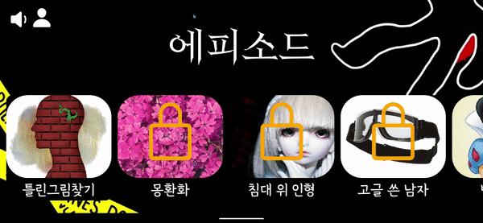

6. 대화화면 NPM

   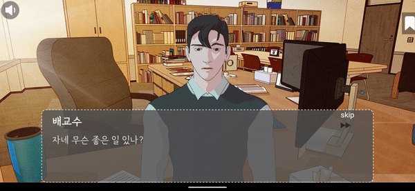

7. 스킵 기능

   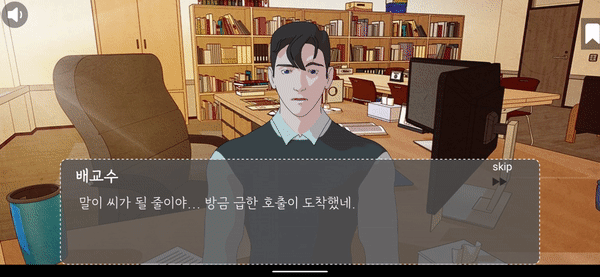

8. 사진 인식(AI)

   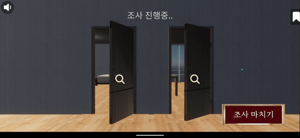

9. 사진 인식 - 이미 찾은 단서일 경우

   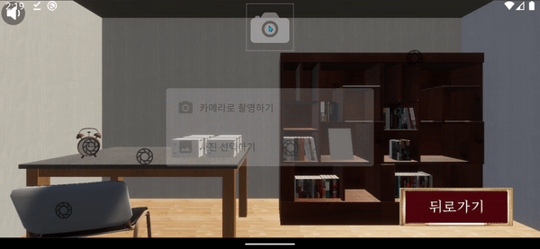

10. 사진 인식 - 적합하지 않는 단서일 경우

    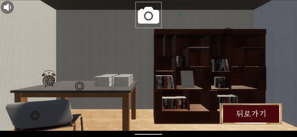

11. 백로그

    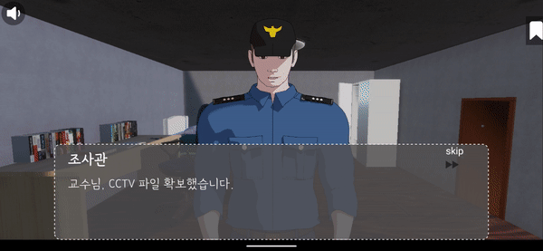

12. 인벤토리

    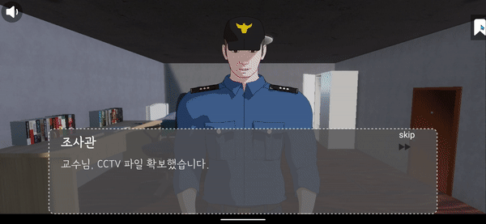

13. 음량 조절

    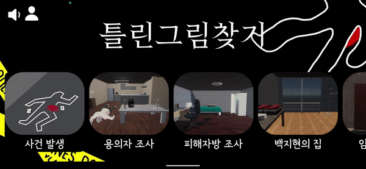

#### **UCC**

[탐정: 렌즈 속 비밀 UCC](https://youtu.be/ICfLxPCzNR0) 

## **:calendar: 프로젝트 일정**

---

* 8월 22일 ~ 10월 7일 (7주)

## **:construction_worker: 프로젝트 팀원**

---

| 이름   | 역할                              | 깃주소                        |
| :----- | --------------------------------- | ----------------------------- |
| 강민재 | 팀장, 디자이너, 프론트            | https://github.com/ManjaKang  |
| 박지하 | 팀원, 프론트엔드                  | https://github.com/bgpjh      |
| 배상현 | 팀원, 백엔드, 작가(시나리오 작성) | https://github.com/ClovesJava |
| 배찬비 | 팀원, 백엔드                      | https://github.com/chanbi428  |
| 손준혁 | 팀원, 백엔드, 인공지능            | https://github.com/sonjuhy    |
| 최지은 | 팀원, 프론트엔드                  | https://github.com/zzieunchoi |

